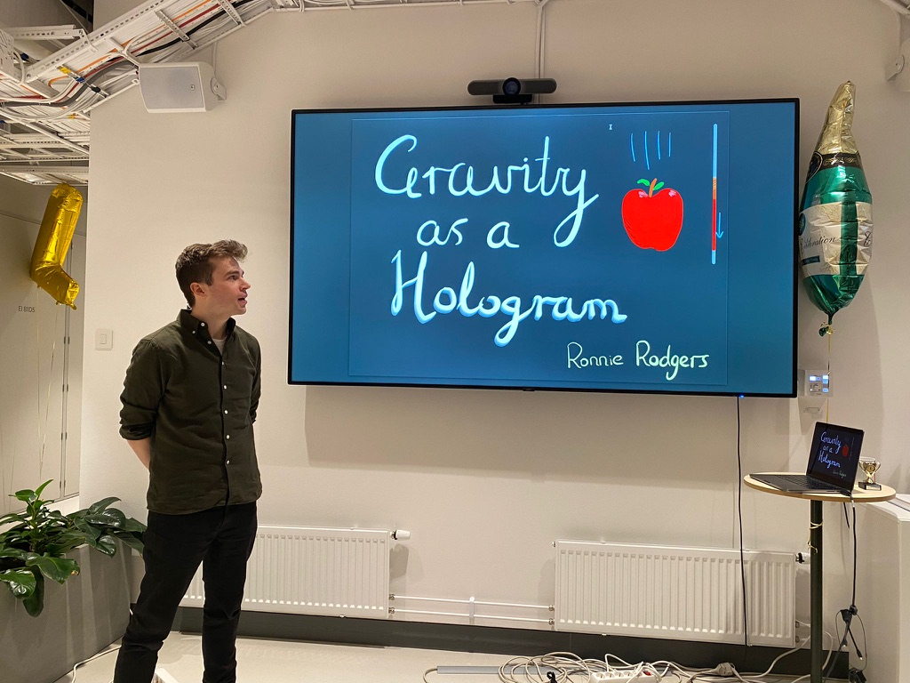

Test paragraph.

I am Ronnie Rodgers, a theoretical physicist working as a postdoc at [Nordita](https://nordita.org/), the Nordic Institute for Theoretical Physics, in Stockholm. On this website you can find information about my research and teaching activities. If you'd like to know more, you can contact me at ronnie.rodgers@su.se.
<figure>  <figcaption>This is me talking aboout my research at <a href="https://scientifika.se/">Scientifika</a>, a weekly series of talks given by researchers in Stockholm aimed at students and young researchers. </figcaption> </figure>

 I work on various aspects of [holography](https://en.wikipedia.org/wiki/Holographic_principle), the idea that gravity can be described by physics in lower dimensions, similar to how a hologram encodes a 3D image on a 2D surface. My research is funded by the European Union through a Marie Skłodowska-Curie Actions postdoctoral fellowship, [which you can read about here](HATS.md).